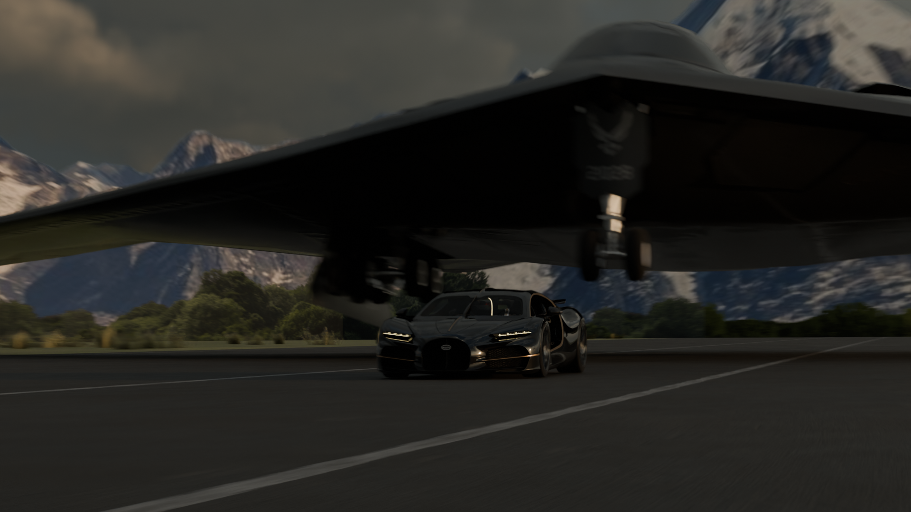
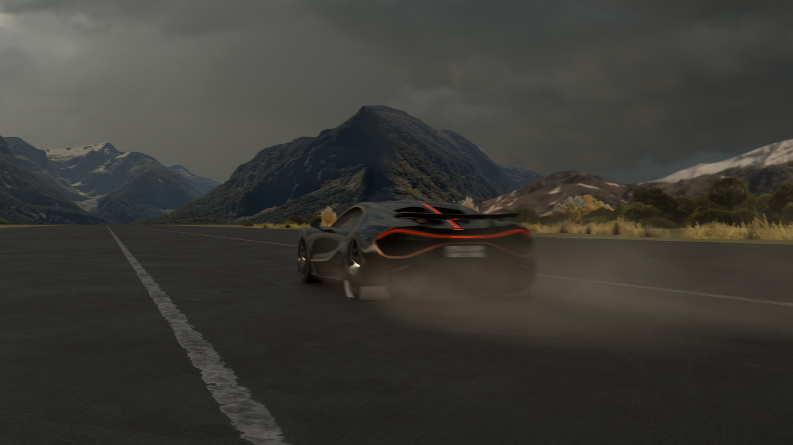
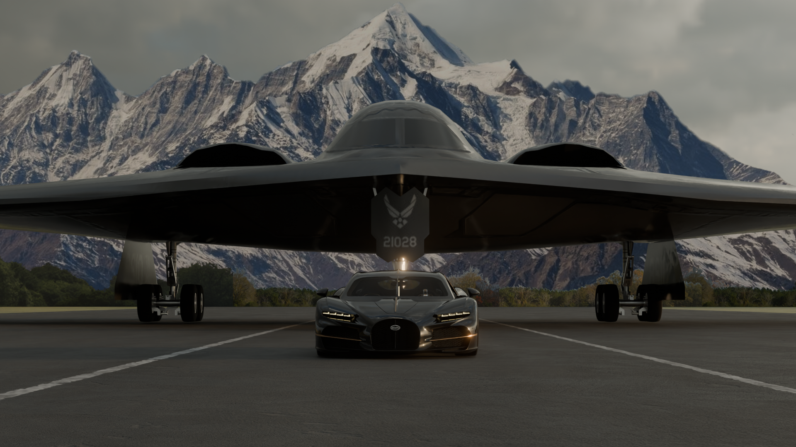
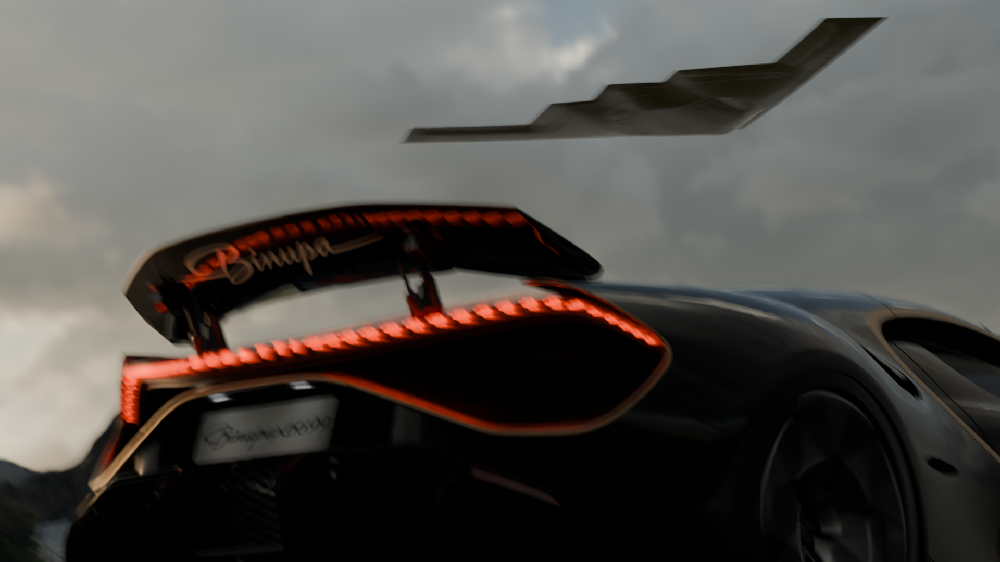
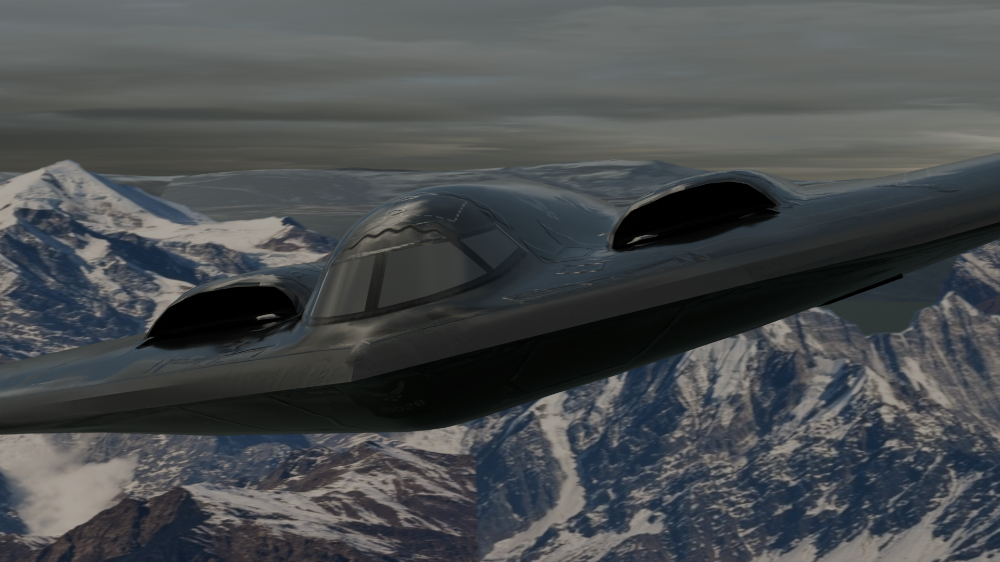
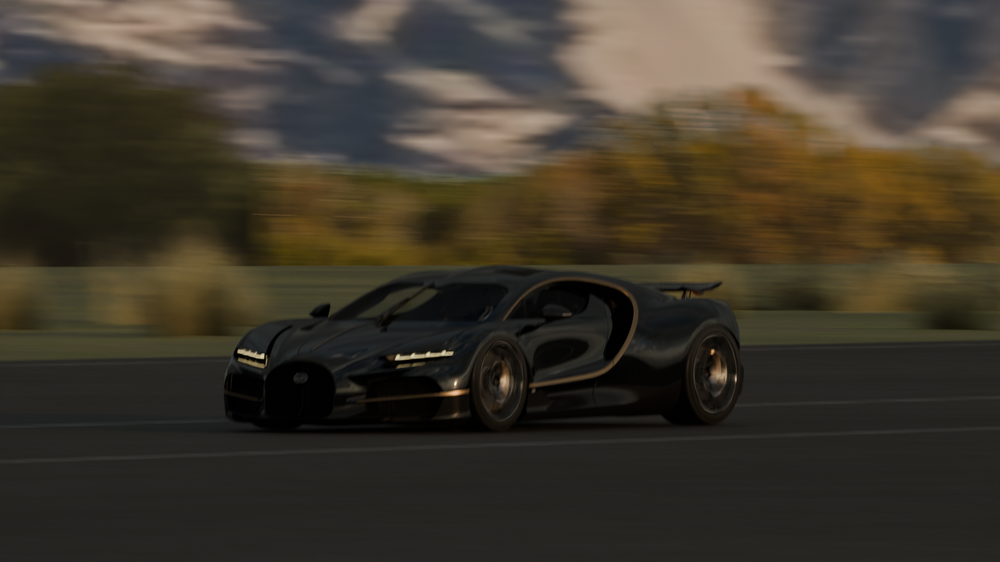

# BUGATTI TOURBILLON & B-2 SPIRIT — CINEMATIC

<table>
<tr>
<td></td>
<td></td>
</tr>
</table>

## Overview

A cinematic Blender project featuring the **Bugatti Tourbillon** and **B-2 Spirit**, created with a strong focus on environmental design, realism, lighting, and cinematic presentation.

This was the first major project I started before beginning the Stardance mission. I later brought the project into Stardance and continued developing it as part of the challenge.

A large part of the project focused on building and refining the surrounding environment to create a more realistic scene while keeping the project optimized enough to run efficiently on my hardware.

<table>
<tr>
<td></td>
<td></td>
</tr>
</table>

## Environment & Scene

The scene was developed around the Bugatti Tourbillon and B-2 Spirit, with additional environmental work used to make the overall presentation feel more realistic and cinematic.

The environment, lighting, materials, and scene elements were continuously refined throughout the project.

Optimization was also an important part of the workflow, keeping the scene detailed while reducing unnecessary performance costs and allowing it to run more efficiently.

<table>
<tr>
<td></td>
<td></td>
</tr>
</table>

## Cinematic

The project was created with cinematic presentation in mind, including scene composition, camera work, lighting, and environmental detail.

**YouTube Video:** [wach the full video]

## Music

**Party Funk (Slowed)** — Young Madz & MC Zudo Boladão

**Music:** [Listen on YouTube Music](https://music.youtube.com/watch?v=shf2MpDCu6w&si=0EZCEaUtu-Xbep_X)

**Artists:**

* [Young Madz]
* [MC Zudo Boladão]

## Original Models & Credits

This cinematic uses two original 3D models sourced from Sketchfab. Both models were modified and incorporated into the project for the final cinematic.

### B-2 Spirit

**Original Model:** [B-2 Spirit — Sketchfab](https://sketchfab.com/3d-models/b2-95e17d9e023d41a29e8e6d9e0598a434)

**Original Creator:** [CloudHubOmniTeam](https://sketchfab.com/cloudhub)

**License:** CC Attribution (CC BY)

The original B-2 Spirit model was modified with additional changes and integrated into my own environment and cinematic scene.

### Bugatti Tourbillon

**Original Model:** [2026 Bugatti Tourbillon — Sketchfab](https://sketchfab.com/3d-models/2026-bugatti-tourbillon-4f63f5a74611477989cefd9861b9784a)

**Original Creator:** [Ddiaz Design](https://sketchfab.com/ddiaz-design)

**License:** CC Attribution-NonCommercial-ShareAlike (CC BY-NC-SA)

The original Bugatti Tourbillon model was substantially modified and customized for this project, including changes made to fit my own scene, environment, materials, and cinematic presentation.

### My Work

The final project includes my own:

* Environment and scene design
* Scene optimization
* Materials and visual modifications
* Lighting
* Camera composition
* Cinematic setup
* Additional scene elements
* Final rendering and presentation

## Project Info

* **Software:** Blender
* **Project Type:** 3D Cinematic
* **Subjects:** Bugatti Tourbillon & B-2 Spirit
* **Focus:** Environment, Realism, Optimization & Cinematic Presentation
* **Stardance Time:** ~20 hours
* **Pre-Stardance Time:** ~30 hours
* **Total Estimated Work:** ~50 hours
* **Status:** Completed

